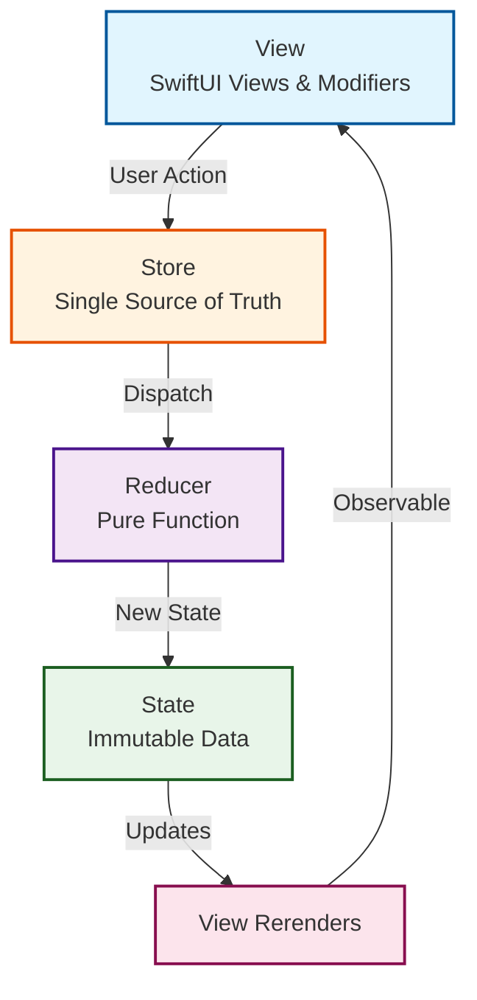
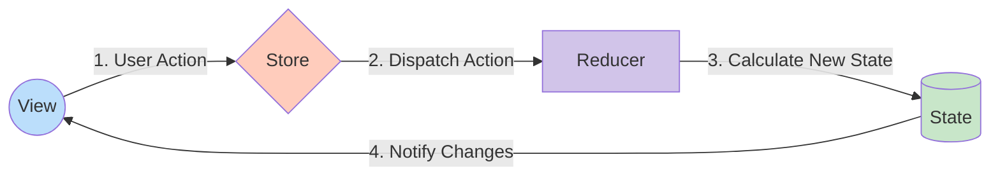
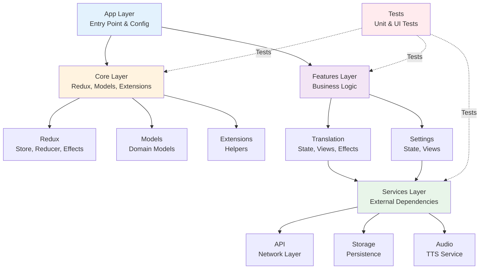
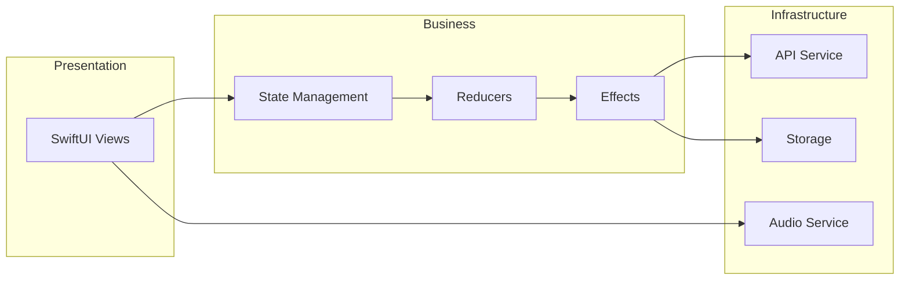

# TranslateApp iOS 🌍

[](https://swift.org)
[](https://developer.apple.com/ios/)
[](https://redux.js.org/understanding/thinking-in-redux/motivation)
[](LICENSE)

An iOS translation application built with SwiftUI, featuring a custom Redux-like unidirectional data flow architecture. This educational project demonstrates state management patterns, API integration, and Swift 6 modern concurrency features.
<!--
## 📱 Screenshots

<p align="center">
  
  
  
</p>
-->

## ✨ Features

### Core Functionality
- 🔤 **Text Translation** - Translate text between multiple languages
- 🔄 **Language Swap** - Quick swap between source and target languages
- 📋 **Copy Translation** - One-tap copy translated text to clipboard
- 🗑️ **Clear Text** - Quick clear input and output fields
<!-- - 🌐 **Multi-language Support** - Support for 10+ languages -->

### Advanced Features
- ⚡ **Real-time Translation** - Instant translation as you type (with debouncing)
- 🎯 **Smart Language Detection** - Auto-detect source language
<!--
- 📱 **Responsive Design** - Optimized for all iOS devices
- 🌙 **Dark Mode** - Full dark mode support
- ♿ **Accessibility** - VoiceOver and Dynamic Type support
-->

## 🏗️ Architecture

This project implements a **Redux-like Unidirectional Data Flow** architecture with the following principles:

### Core Concepts


### Alternative circular flow representation:


### Key Components

#### 1. **State**
Single immutable source of truth for the entire application
```swift
struct AppState: Equatable {
    var sourceText: String
    var translatedText: String
    var sourceLanguage: Language
    var targetLanguage: Language
    var isLoading: Bool
    var error: TranslationError?
}
```

#### 2. **Actions**
Describe intentions to change state
```swift
enum AppAction {
    case textEntered(String)
    case translate
    case translationReceived(Result<String, Error>)
    case swapLanguages
}
```

#### 3. **Reducer**
Pure function that computes new state
```swift
func appReducer(state: inout AppState, action: AppAction) -> Effect<AppAction>
```

#### 4. **Effects**
Handle side effects like API calls
```swift
struct Effect<Action> {
    let run: (@escaping (Action) -> Void) async -> Void
}
```

## 🛠️ Tech Stack

- **UI Framework**: SwiftUI
- **Architecture**: Custom Redux/Unidirectional Data Flow
- **Language**: Swift 6.0
- **Minimum iOS**: 18.0
- **Concurrency**: Swift Structured Concurrency (async/await)
- **Networking**: URLSession with async/await
- **API**: [FTApi Translation Service](https://ftapi.pythonanywhere.com/)
- **Testing**: XCTest + Swift Testing framework
- **Storage**: UserDefaults for preferences


## High-level architectural module diagram



## modular dependency diagram



<!--
## 📂 Project Structure

```
TranslateApp-ios/
├── App/
│   ├── TranslateApp.swift              # App entry point
│   └── Configuration/                   
│       └── AppConfig.swift
├── Core/
│   ├── Components/                     # 
│   │   ├── Buttons/
│   │   │   ├── ClearButton.swift       # Clear text button
│   │   │   └── AudioButton.swift       # Audio playback button
│   │   └── Common/
│   │       └── LoadingView.swift       # 
│   ├── StateManagement/                
│   │   ├── Store.swift                 
│   │   ├── AppState.swift              
│   │   ├── AppAction.swift             
│   │   ├── AppReducer.swift            
│   │   ├── Reducer.swift               
│   │   └── Effect.swift                
│   ├── Models/
│   │   ├── Language.swift              
│   │   ├── TranslationError.swift      
│   │   └── Translation.swift           
│   └── Extensions/
│       ├── HapticFeedback.swift        # Haptic feedback helper
│       ├── View+Extensions.swift
│       └── String+Extensions.swift
├── Features/
│   ├── Translation/
│   │   ├── Views/
│   │   │   ├── TranslationView.swift          # Main translation screen
│   │   │   ├── CompactLanguageBar.swift       # Language selector bar
│   │   │   ├── LanguageMenu.swift             # Dropdown language menu
│   │   │   ├── SourceTextSection.swift        # Input text field
│   │   │   ├── ActionButtonsSection.swift     # Action buttons
│   │   │   └── TranslatedTextSection.swift    # Translation result
│   │   ├── State/
│   │   │   ├── TranslationState.swift
│   │   │   └── TranslationAction.swift
│   │   ├── Reducers/
│   │   │   └── TranslationReducer.swift
│   │   └── Effects/
│   │       └── TranslationEffects.swift
│   └── Settings/
│       ├── Views/
│       │   └── SettingsView.swift
│       └── State/
│           └── SettingsState.swift
├── Services/
│   ├── API/
│   │   ├── TranslationService.swift    # Translation API client
│   │   ├── APIEndpoint.swift           
│   │   └── NetworkError.swift          
│   ├── Storage/
│   │   └── UserDefaultsService.swift
│   └── Audio/
│       └── TextToSpeechService.swift
├── Resources/
│   ├── Assets.xcassets
│   ├── Localizable.strings
│   └── Info.plist
└── Tests/
    ├── UnitTests/
    │   ├── StateManagement/
    │   │   ├── StoreTests.swift
    │   │   ├── AppReducerTests.swift
    │   │   └── EffectTests.swift
    │   ├── Services/
    │   │   └── TranslationServiceTests.swift
    │   └── Mocks/
    │       └── MockTranslationService.swift
    └── UITests/
        └── TranslationFlowTests.swift
```
-->
## 🚀 Getting Started

### Prerequisites

- macOS 13.0 or later
- Xcode 15.0 or later
- iOS 18.0+ deployment target
- Active internet connection for API calls

### Installation

1. **Clone the repository**
```bash
git clone https://github.com/alexmeshchenko/TranslateApp-ios.git
cd TranslateApp-ios
```

2. **Open in Xcode**
```bash
open TranslateApp.xcodeproj
```

3. **Build and Run**
- Select your target device or simulator
- Press `Cmd + R` to build and run
- Alternatively, use `Cmd + U` to run tests

### Configuration

No additional configuration required. The app uses the public translation API without authentication.

## 🔌 API Reference

### Base URL
```
https://ftapi.pythonanywhere.com
```

### Endpoints

#### Translate Text
```http
POST /translate
Content-Type: application/json

Request:
{
  "text": "Hello world",
  "source_lang": "en",
  "target_lang": "es"
}

Response:
{
  "translated_text": "Hola mundo",
  "source_lang": "en",
  "target_lang": "es"
}
```

#### Get Supported Languages
```http
GET /languages

Response:
{
  "languages": [
    {"code": "en", "name": "English"},
    {"code": "es", "name": "Spanish"},
    {"code": "fr", "name": "French"}
  ]
}
```
<!--
## 🧪 Testing

### Run All Tests
```bash
xcodebuild test -scheme TranslateApp -destination 'platform=iOS Simulator,name=iPhone 15'
```

### Test Coverage
The project maintains:
- **70%+** coverage for business logic
- **50%+** coverage for UI components
- **90%+** coverage for Redux reducers

### Testing Strategy
- **Unit Tests**: Reducers, Services, Models
- **Integration Tests**: API calls, Redux flow
- **UI Tests**: Critical user paths

## 📱 Requirements
-->
### Functional Requirements

#### ✅ Basic Level
- [X] **Text Fields**
  - [X] Input text field for source text
  - [X] Output text field for translated text (read-only)
- [X] **Input Processing**
  - [X] Handle text input events
  - [X] Validate input (empty, max length)
- [X] **API Integration**
  - [X] Connect to translation API
  - [X] Process response and display translated text
- [X] **Language Management**
  - [X] Implement language switching UI
  - [X] Quick swap languages button
- [X] **Utility Features**
  - [X] Clear text button
  - [X] Copy translated text functionality

#### 🚀 Advanced Level
- [X] **Animations**
  - [X] Loading effect during translation request
  - [X] Smooth transitions between states
- [X] **Audio**
  - [X] Text-to-speech for source text
  - [X] Text-to-speech for translated text
- [X] **Preferences**
  - [X] Auto-save last selected language pair
  - [X] Restore language selection on app launch
- [X] **Favorite Languages**
  - [X] Mark languages with star for quick access
  - [X] Prioritize favorite languages in picker

### Non-Functional Requirements
- **Performance**: Translation response < 2 seconds
- **Reliability**: 99% uptime during normal operation
- **Usability**: Intuitive UI following iOS HIG
- **Accessibility**: Full VoiceOver support
- **Localization**: Support for system language

## 🎨 Design Guidelines

### UI/UX Principles
- **Clarity**: Clear visual hierarchy
- **Deference**: Content-first approach
- **Depth**: Subtle layering and animations
- **Consistency**: Following iOS Human Interface Guidelines

### Color Scheme
- Primary: System Blue
- Background: System Background
- Text: Label colors (adaptive)
- Accent: Tint colors for actions

## 🔧 Development

### Code Style
- Follow [Swift Style Guide](https://google.github.io/swift/)
- Use SwiftLint for code consistency
- Prefer composition over inheritance
- Keep views small and focused

### Git Flow
```
main
  └── develop
        ├── feature/translation-ui
        ├── feature/redux-setup
        └── bugfix/api-error-handling
```

### Commit Convention
```
<type>(<scope>): <subject>

Types: feat, fix, docs, style, refactor, test, chore
Example: feat(translation): add language swap animation
```

## 🤝 Contributing

This is an educational project, but feedback and suggestions are welcome!

1. Fork the repository
2. Create your feature branch (`git checkout -b feature/amazing-feature`)
3. Commit your changes (`git commit -m 'feat: add amazing feature'`)
4. Push to the branch (`git push origin feature/amazing-feature`)
5. Open a Pull Request

## 📄 License

This project is licensed under the MIT License - see the [LICENSE](LICENSE) file for details.

## 👏 Acknowledgments

- SwiftUI Marathon organizers for the challenge
- [FTApi](https://ftapi.pythonanywhere.com) for providing the translation API
- Apple Developer Documentation for SwiftUI resources

## 📞 Contact

Alex Meshchenko - [@alexmeshchenko](https://github.com/alexmeshchenko)

Project Link: [https://github.com/alexmeshchenko/TranslateApp-ios](https://github.com/alexmeshchenko/TranslateApp-ios)

---

<p align="center">Made with ❤️ using SwiftUI and Redux</p>
<p align="center">
  <a href="#translateapp-ios-">Back to top ↑</a>
</p>
